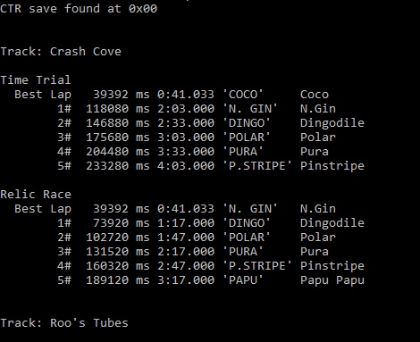

# ctr-psx-leaderboard-reader
 Crash Team Racing (PSX) Leaderboard Reader
  
  
  
A little experiment with binary reading. I really like Crash Team Racing and was curious what the structure of the saves are like, so I made a simple leaderboard reader. It shows everything from Time Trials and Relic Races, including some times that aren't displayed in-game (Relic Race best lap and the millisecond precision.)  
  
I'm planning on eventually creating an online leaderboard so you can easily compete against others without having to constantly send best times to each other. Of course, it isn't supposed to be super competitive or secure (although funnily enough, the saves have a checksum), just a bit of fun.
  
## Usage
Simply pass the save filename as an argument to `leaderboard-reader.py` and it will print a readable leaderboard.  
E.g. `leaderboard-reader.py example_save.mcs`  
It searches for a binary pattern, so it will work with any memory card format as long as the save isn't compressed or altered from its original state. Currently it will only return the first CTR save of a memory card file.
